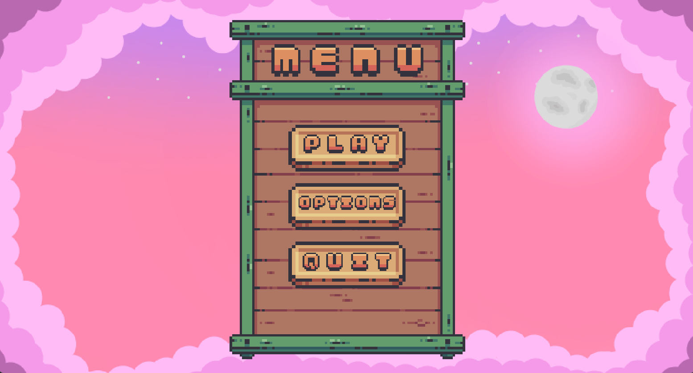
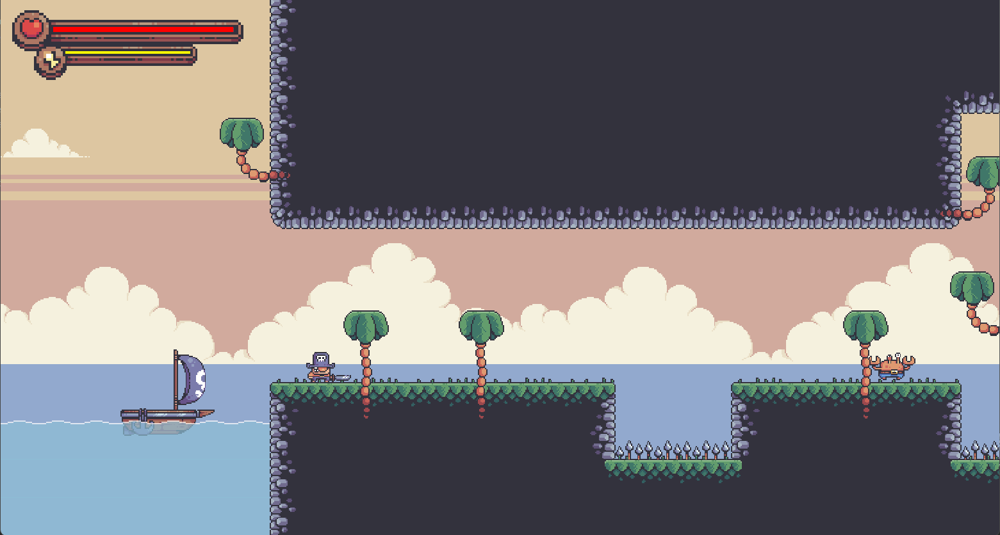
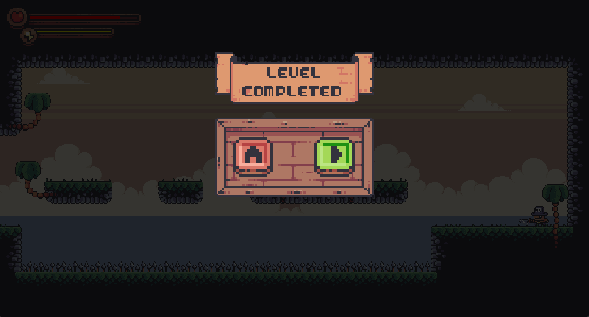
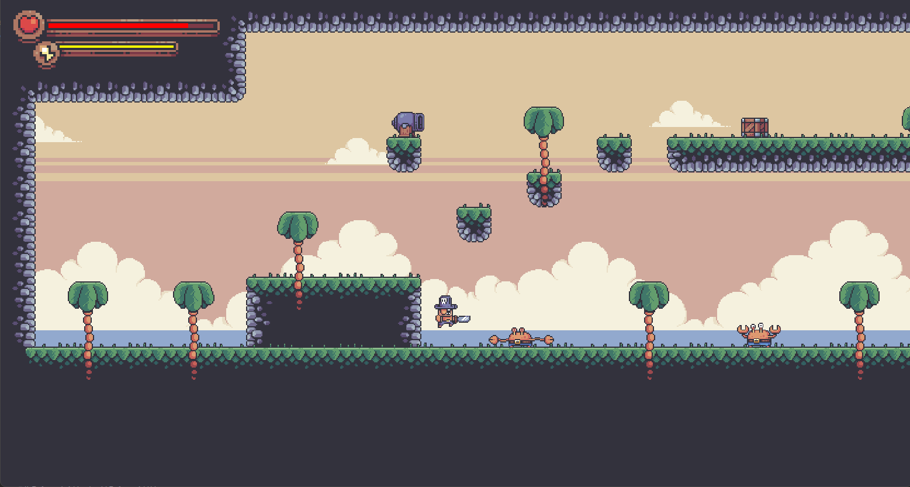
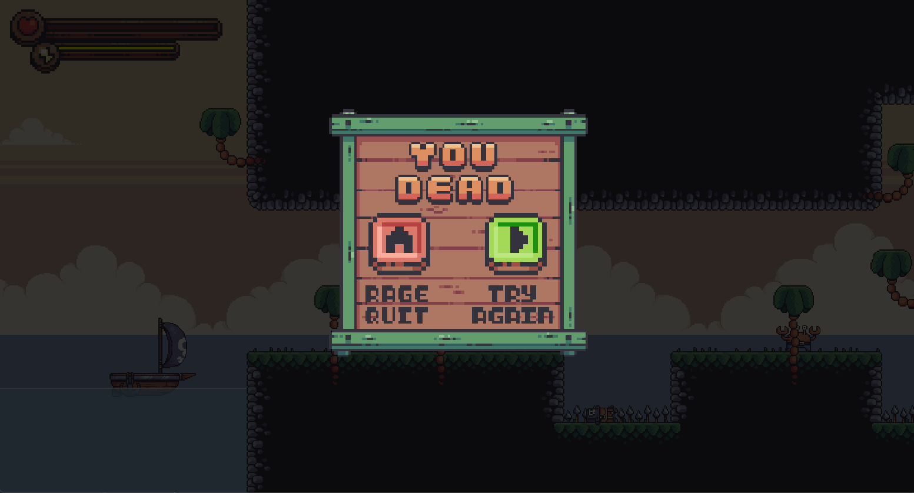
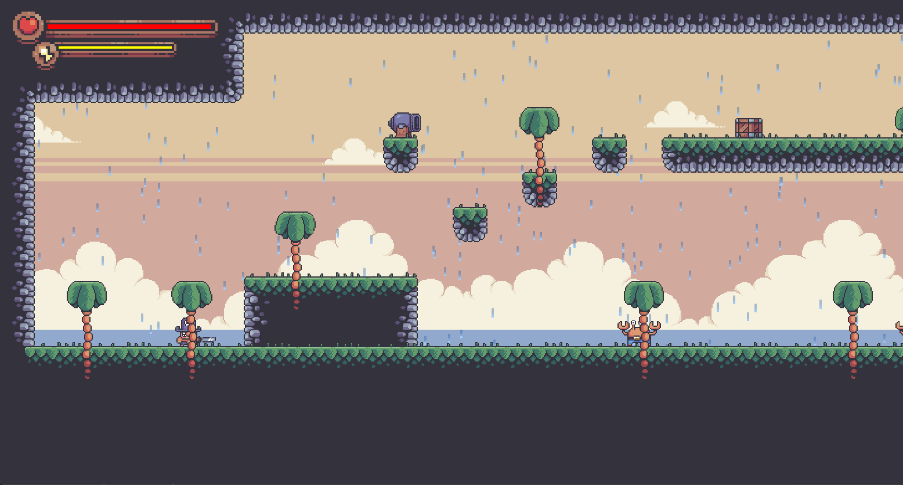
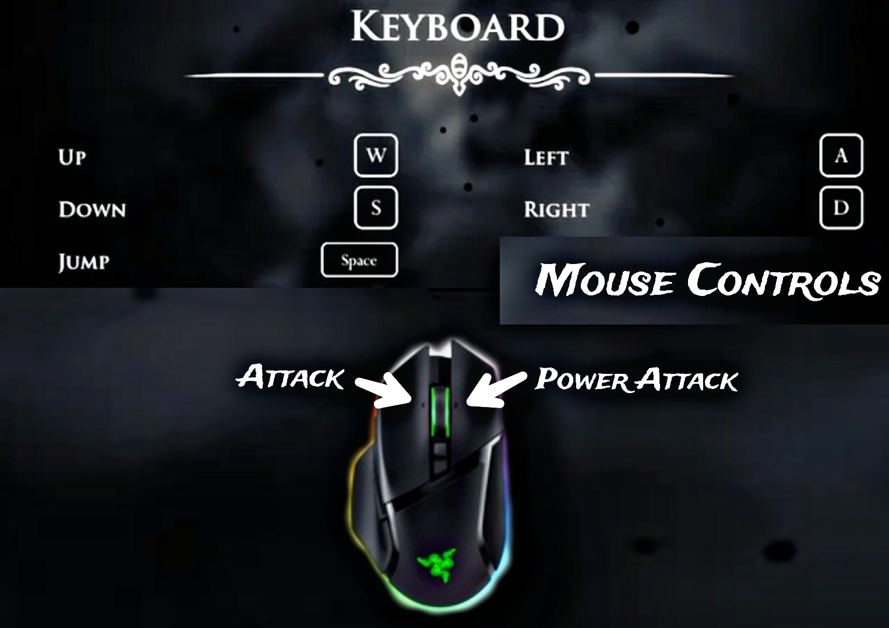

<<<<<<< HEAD
## Goto Branch Where final Project is Pushed. 
<a href="https://github.com/chetan360/Platformer-Game/tree/ep28_final"> Click Here.</a>
=======
# Platformer-Game

**A Platformer Game is Codded in Java Language using Java AWT and Swing GUI Libraries.**

## Description

**What is a Platformer Game?**
<br>
A platformer game is a type of video game in which the 
player controls a character who must jump and climb their 
way through a series of obstacles to reach the end of the 
level.

## Project Scope:
Platformer video games have been around since the early 
1980s, and they continue to be popular today. One reason 
for their enduring popularity is that they are easy to pick up 
and play

## Requirements for using it
- Need JDK and ids for running the game (project).
- Any OS.
- Processor: 2.4 GHz Dual Core.
- 2 GB RAM (DDR2).
- 500 MB Storage On Disk Space (Minmum 200 MB).

**Note**: I am having problem with this project while exporting to runnable jar. If any one solves this issue the please remind me on this email (chetansmankar360@gmail.com).


## How to run the Game ?
- Clone or Download file from <a href="https://github.com/chetan360/Platformer-Game/tree/ep28_final"> Here.</a>
- Import it in any IDE. (Make sure the Java is installed and configured on your Device).
- Built the project after import.
- Run the Project using MainClass.
- Play and enjoy.


## Screenshots 🖼️

### 01. Game Menu



### 02. Game Play



### 03. Level Completed Screen



### 04. Combat between Player and Enemy



### 05. Death Screen



### 06. Rain in Game




## Game Controls

W is up, A is left, S is down, D is right and Space bar. Ring finger on A, middle finger on either W or S, index finger on D and thoumb on Space bar. And using right hand we can use mouse controls as left click for attack and right click for power attack.


# Creadits
- Arts : PIXELFROG
- Sound : SONGS BY SVL SVLITCH.IO
- Effects : Public Domain FREESOUND.ORG
- Also YT Tutorials.
- Big Thanks to KAARINGAMING.
>>>>>>> ep28_final

## MIT LICENSE 📔

```LICENSE

MIT License

Copyright (c) 2022 Alkaison

Permission is hereby granted, free of charge, to any person obtaining a copy
of this software and associated documentation files (the "Software"), to deal
in the Software without restriction, including without limitation the rights
to use, copy, modify, merge, publish, distribute, sublicense, and/or sell
copies of the Software, and to permit persons to whom the Software is
furnished to do so, subject to the following conditions:

The above copyright notice and this permission notice shall be included in all
copies or substantial portions of the Software.

THE SOFTWARE IS PROVIDED "AS IS", WITHOUT WARRANTY OF ANY KIND, EXPRESS OR
IMPLIED, INCLUDING BUT NOT LIMITED TO THE WARRANTIES OF MERCHANTABILITY,
FITNESS FOR A PARTICULAR PURPOSE AND NONINFRINGEMENT. IN NO EVENT SHALL THE
AUTHORS OR COPYRIGHT HOLDERS BE LIABLE FOR ANY CLAIM, DAMAGES OR OTHER
LIABILITY, WHETHER IN AN ACTION OF CONTRACT, TORT OR OTHERWISE, ARISING FROM,
OUT OF OR IN CONNECTION WITH THE SOFTWARE OR THE USE OR OTHER DEALINGS IN THE
SOFTWARE.
```
